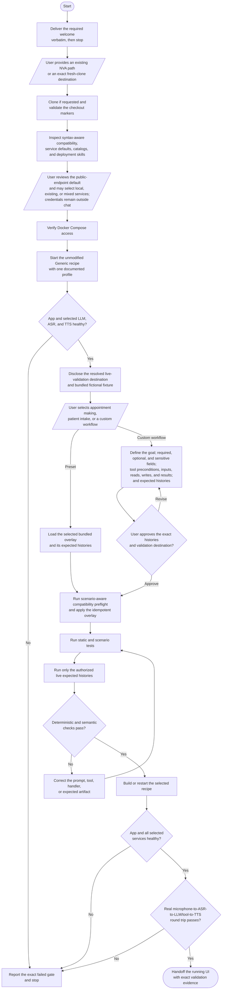
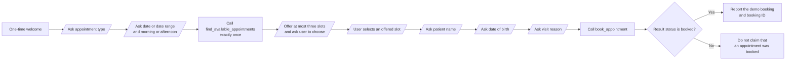
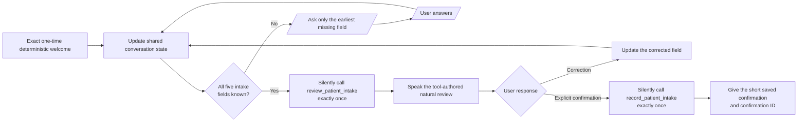

# User Experience Flowchart

This is a high-level view of the gated workflow defined in `SKILL.md`. The
skill remains the source of truth for exact prompts, authorization boundaries,
validation rules, and handoff details.

The main user-controlled moments are the repository location, runtime service
mode, credential setup, scenario selection, and—for custom workflows—the exact
conversation histories and live-validation destination. If the user does not
request a runtime override after disclosure, the skill uses public NVIDIA AI
Endpoints for the LLM, ASR, and TTS. Selecting a bundled preset authorizes only
the disclosed fictional fixture and resolved destination. A custom workflow
requires explicit approval before its histories are transmitted. Every gate
must pass before the workflow moves to the next step; a failed gate is reported
as blocked or pending rather than treated as success.

The appointment-making overlay enforces this patient-facing flow:

Knowing the appointment type alone never advances directly to lookup. The
lookup tool also enforces the required morning-or-afternoon preference, so a
prompt error cannot silently broaden the search. Each post-selection booking
field is requested in its own turn, and greetings do not reset or replay the
current slot-selection state.

The patient-intake overlay enforces this patient-facing flow:

The five fields are full name, date of birth, current symptoms, current
medications, and preferred pharmacy. The review and save tools author the
spoken text directly. Corrections trigger a complete re-review before another
confirmation can save the record. The runtime speech guard prevents markdown
or field-dump formatting, removes commas between a spoken ordinal day and year,
and discards model preambles before tool results.

## How the Package Is Organized

- `SKILL.md` owns the shared gates, authorization boundaries, and workflow order.
- `references/deployment-modes.md` owns the public, managed-local, existing, and mixed runtime branches.
- The scenario directories own their prompts, tool contracts, expected histories, and scenario tests.
- `scripts/` provides deterministic inspection, overlay application, and live-history validation.
- `tests/` and `evals/` validate the package and publishing contracts; generated reports summarize evidence but do not redefine runtime behavior.
