# Skill Workflow Flowchart

This diagram is a human-readable overview of the workflow in `SKILL.md` and the
phase references. Keep the phase reference files as the source of truth for
execution details.

```mermaid
flowchart TD
    A([Developer invokes the skill]) --> B[Phase 1: Prerequisite references]
    B --> B1[Ask permission to set up references]
    B1 --> B2[Check or clone required reference repos]
    B2 --> B3[Verify five dependent sub-skill SKILL.md files]
    B3 --> B4[Optionally symlink sub-skills for future sessions]
    B4 --> G1{Prerequisites readable?}
    G1 -- No --> X1[Stop and report blocker]
    G1 -- Yes --> C[Phase 2: Specify]

    C --> C1[Confirm Nemotron Voice Agent interface and output location]
    C1 --> C2[Clone Nemotron Voice Agent beside the output repo]
    C2 --> C3[Gather agent capabilities and data-source choices]
    C3 --> C4[Choose LangGraph graph pattern]
    C4 --> C5[Choose agent LLM model and endpoint]
    C5 --> C6{Enable NeMo Guardrails?}
    C6 -- No --> C10[Confirm ASR, TTS, LLM, and service endpoints]
    C6 -- Yes --> C7[Read live NeMo Guardrails docs]
    C7 --> C8[Choose rail types, safety model, rules, and test cases]
    C8 --> C10
    C10 --> C11[Draft feature specs]
    C11 --> C12[Always: langgraph-agent spec and fastapi-server spec]
    C12 --> C13[If enabled: guardrails spec]
    C13 --> G2{All spec.md files approved?}
    G2 -- Revise --> C11
    G2 -- Yes --> D[Phase 3: Plan]

    D --> D1[For each selected feature, write plan.md]
    D1 --> G3{Plan approved?}
    G3 -- Revise --> D1
    G3 -- Yes --> D2[Write tasks.md]
    D2 --> G4{Tasks approved?}
    G4 -- Revise --> D2
    G4 -- More features --> D1
    G4 -- All approved --> E[Phase 4: Implement]

    E --> E1[Verify sub-skill gate before writing repo files]
    E1 --> E2[Read or invoke required LangChain, LangGraph, RAG, and Nemotron guidance]
    E2 --> E3[Build data layer, tools, and LangGraph agent]
    E3 --> E4{Guardrails selected?}
    E4 -- Yes --> E5[Add guardrails config, graph integration, and tests]
    E4 -- No --> E6[Skip guardrails files]
    E5 --> E7[Copy and adapt FastAPI OpenAI-compatible server]
    E6 --> E7
    E7 --> E8[Write Docker Compose, env examples, docs, tests, and runnable skill]
    E8 --> F[Phase 5: Validate and hand off]

    F --> F1[Run static checks and docker compose config]
    F1 --> F2[Audit generated runnable skill]
    F2 --> F3[Run unit tests, server tests, and optional guardrails checks]
    F3 --> F4[Run full Docker Compose stack smoke tests]
    F4 --> G5{Validation passed?}
    G5 -- Fix and rerun --> E
    G5 -- Yes --> H([Final checklist and developer handoff])
```

## Suggested Placement

Keep this diagram in `references/workflow-flowchart.md`, linked from:

- `SKILL.md` Additional Resources, so an agent can discover it when the user asks
  for a workflow overview.
